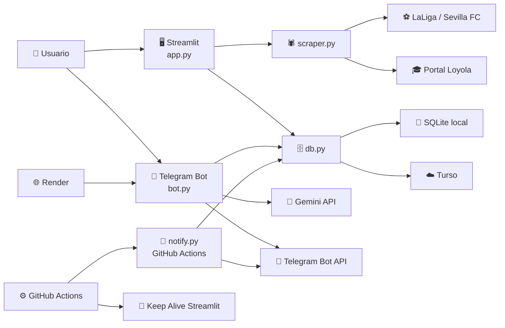

# 🎓 AutoGestor

<div align="center">

### 📚 Agenda universitaria visual con Streamlit, scraping automático, Telegram y bot con IA

Organiza tareas, deadlines, clases, rutinas, eventos y partidos del Sevilla FC desde una sola base de datos.

</div>

---

## ✨ Qué es este proyecto

**AutoGestor** es un sistema personal de organización pensado para un estudiante universitario.

Incluye:

- 🖥️ Una app en **Streamlit** para gestionar tareas y calendario.
- 🗄️ Una capa de datos compatible con **SQLite local** y **Turso remoto**.
- 🕷️ Scraping automático del horario de **Loyola** y de los próximos partidos del **Sevilla FC**.
- 📩 Notificaciones automáticas por **Telegram**.
- 🤖 Un bot de **Telegram + Gemini** para consultar la agenda en lenguaje natural.
- ⚙️ Workflows de **GitHub Actions** para enviar avisos y mantener viva la app.

> 💡 Modo recomendado: si quieres que la app, el bot y las automatizaciones compartan exactamente los mismos datos, configura **Turso** en todos los servicios.

---

## 🧩 Qué incluye el repositorio

| Archivo | Rol |
|---|---|
| `app.py` | Interfaz principal en Streamlit |
| `db.py` | Acceso a datos con fallback automático: Turso o SQLite |
| `scraper.py` | Scraping de clases Loyola y partidos del Sevilla FC |
| `notify.py` | Generador de resúmenes y avisos por Telegram |
| `bot.py` | Bot conversacional con FastAPI + Telegram + Gemini |
| `render.yaml` | Configuración de despliegue del bot en Render |
| `requirements.txt` | Dependencias de la app Streamlit |
| `requirements-bot.txt` | Dependencias del bot |
| `packages.txt` | Paquetes del sistema para Chromium/Chromedriver |
| `.github/workflows/*` | Automatizaciones de GitHub Actions |
| `.streamlit/secrets.toml` | Secrets locales de Streamlit para Turso |

---

## 🏗️ Arquitectura visual



---

## 🗂️ Estructura del proyecto

```text
autogestor/
├── .github/
│   └── workflows/
│       ├── aviso_deadlines.yml
│       ├── aviso_partido.yml
│       ├── keep_alive.yml
│       ├── resumen_matutino.yml
│       └── resumen_semanal.yml
├── .streamlit/
│   └── secrets.toml
├── app.py
├── autogestor.db
├── bot.py
├── db.py
├── notify.py
├── packages.txt
├── README.md
├── render.yaml
├── requirements-bot.txt
├── requirements.txt
└── scraper.py
```

---

## 🚀 Cómo clonar el repositorio

```bash
git clone https://github.com/MrCordobex/autogestor.git
cd autogestor
```

---

## 🛠️ Instalación local de la app

### 1. Crear entorno virtual

```bash
python -m venv .venv
```

### 2. Activarlo

**Windows (PowerShell)**

```powershell
.\.venv\Scripts\Activate.ps1
```

**macOS / Linux**

```bash
source .venv/bin/activate
```

### 3. Instalar dependencias de la app

```bash
pip install -r requirements.txt
```

### 4. Arrancar Streamlit

```bash
streamlit run app.py
```

La app se abrirá normalmente en `http://localhost:8501`.

---

## ⚡ Modo rápido: usarlo sin servicios externos

Si solo quieres probar la app en local:

- ✅ No necesitas Turso.
- ✅ No necesitas Telegram.
- ✅ No necesitas Gemini.
- ✅ No necesitas Render.
- ✅ No necesitas GitHub Actions.

En ese modo:

- `db.py` guarda todo en `autogestor.db`.
- La app funciona localmente con **SQLite**.
- El scraping sigue necesitando **Chrome / Chromium + Chromedriver**.

> 💾 Este modo es perfecto para desarrollo o uso personal local.  
> ☁️ Si luego añades bot, notificaciones o despliegue cloud, lo ideal es pasar a **Turso** para que todos lean la misma base de datos.

---

## 🔌 Conexiones externas que puede usar el proyecto

| Servicio | Obligatorio | Lo usa | Para qué sirve | Configuración |
|---|---|---|---|---|
| SQLite local | No | `app.py`, `db.py` | Persistencia local sin cloud | Automático |
| Turso | No, pero recomendado | `app.py`, `db.py`, `notify.py`, `bot.py` | Base de datos compartida entre app, bot y automatizaciones | `st.secrets` o variables de entorno |
| Telegram Bot API | Opcional | `notify.py`, `bot.py` | Enviar avisos y responder mensajes | `TELEGRAM_TOKEN`, `TELEGRAM_CHAT_ID` |
| Gemini API | Opcional | `bot.py` | Respuestas inteligentes sobre tu agenda | `GEMINI_API_KEY` |
| Render | Opcional | `bot.py` | Hospedar el bot con webhook público | `render.yaml` + env vars |
| GitHub Actions | Opcional | `notify.py`, keep alive | Automatizar avisos programados | Secrets del repo |
| Portal Loyola | Opcional | `scraper.py` | Obtener clases automáticamente | Sin API key |
| LaLiga / Sevilla FC | Opcional | `scraper.py` | Obtener próximos partidos | Sin API key |

---

## 🗄️ Cómo funciona la base de datos

`db.py` tiene un comportamiento muy importante:

- Si encuentra credenciales de **Turso**, usa la base remota por HTTP.
- Si no encuentra credenciales, hace fallback a **SQLite local** en `autogestor.db`.

Eso significa:

- 🟢 `app.py` puede funcionar sin internet usando SQLite.
- 🟡 `notify.py` y `bot.py` también pueden funcionar con Turso si les pasas variables de entorno.
- 🔴 Si la app usa SQLite local y el bot/las automatizaciones usan Turso, **no estarán viendo la misma información**.

> ✅ Para una instalación completa y coherente, conecta **todos los servicios a la misma base Turso**.

---

## 🔐 Secrets y variables que debes configurar

### Streamlit local o Streamlit Cloud

El proyecto ya espera esta estructura en `.streamlit/secrets.toml`:

```toml
[turso]
url = "libsql://TU-DB.turso.io"
token = "TU_TOKEN"
```

Esta configuración la usa `db.py` cuando la app corre con Streamlit.

### Variables de entorno para bot y automatizaciones

| Variable | Para qué sirve |
|---|---|
| `TURSO_URL` | URL de la base de datos remota |
| `TURSO_TOKEN` | Token de acceso a Turso |
| `TELEGRAM_TOKEN` | Token del bot de Telegram |
| `TELEGRAM_CHAT_ID` | Chat autorizado para recibir mensajes y usar el bot |
| `GEMINI_API_KEY` | Clave para consultar Gemini |
| `STREAMLIT_URL` | URL pública de la app para el workflow keep alive |

---

## 🧪 Requisitos del scraping

`scraper.py` usa **Selenium** con navegador headless.

Necesitas:

- `selenium`
- `webdriver-manager`
- Chrome o Chromium
- Chromedriver

En Linux o despliegues tipo cloud, este repo ya deja preparado:

```text
packages.txt
chromium
chromium-driver
```

### Qué scrapea exactamente

- 🎓 **Loyola**: horario académico desde el portal `portales.uloyola.es`
- ⚽ **Sevilla FC**: próximos partidos desde `laliga.com`

### Importante

- El scraper de Loyola está apuntando a una URL concreta de curso/grupo.
- Si cambias de curso, campus, titulación o grupo, tendrás que ajustar esa URL en `scraper.py`.
- El scraping guarda el resultado en la tabla `horario_cache`.

---

## 🖥️ Cómo usar la app

Una vez arrancada con `streamlit run app.py`, la app permite:

| Vista | Qué hace |
|---|---|
| `Diaria` | Muestra horario del día, tareas del día y pendientes |
| `Semanal` | Vista compacta por semana con acceso a detalle |
| `Mensual` | Vista de calendario mensual |
| `➕ Nueva Tarea` | Crear tareas normales o deadlines |
| `➕ Nuevo Evento` | Crear rutinas semanales o eventos únicos |
| `📋 Gestionar Todo` | Editar, completar o borrar tareas y horarios |

Además, en la barra lateral puedes:

- 📅 Elegir la fecha base.
- 🔄 Lanzar manualmente el scraping de Loyola.
- 🔄 Lanzar manualmente el scraping del Sevilla FC.
- 🕒 Ver la última fecha de actualización del caché.

---

## 🤖 Bot de Telegram con IA

`bot.py` monta un servicio **FastAPI** que:

- recibe mensajes por webhook,
- comprueba que el `chat_id` esté autorizado,
- construye contexto con tareas, horarios, clases y partidos,
- pregunta a **Gemini**,
- y responde por **Telegram**.

### Dependencias del bot

```bash
pip install -r requirements-bot.txt
```

### Ejecución local del bot

```bash
python -m uvicorn bot:app --host 0.0.0.0 --port 8000 --reload
```

### Variables necesarias para el bot

```powershell
$env:TELEGRAM_TOKEN="TU_TOKEN"
$env:TELEGRAM_CHAT_ID="TU_CHAT_ID"
$env:GEMINI_API_KEY="TU_GEMINI_API_KEY"
$env:TURSO_URL="libsql://TU-DB.turso.io"
$env:TURSO_TOKEN="TU_TURSO_TOKEN"
```

### Rutas del bot

| Ruta | Uso |
|---|---|
| `/` | Health check |
| `/setup` | Registra el webhook en Telegram usando la URL pública del servicio |
| `/webhook` | Endpoint que recibe mensajes desde Telegram |

> 🌍 Para que Telegram pueda llamar al webhook, el bot necesita una **URL pública**.  
> Lo más cómodo en este repo es desplegarlo en **Render**.

---

## ☁️ Despliegue del bot en Render

Este repo ya trae `render.yaml` preparado para el bot.

### Variables configuradas en `render.yaml`

- `TELEGRAM_TOKEN`
- `TELEGRAM_CHAT_ID`
- `GEMINI_API_KEY`
- `TURSO_URL`
- `TURSO_TOKEN`

### Flujo recomendado

1. Crea el servicio en Render conectando este repositorio.
2. Añade las variables de entorno.
3. Deja que arranque con:

```bash
python -m uvicorn bot:app --host 0.0.0.0 --port $PORT
```

4. Cuando el servicio esté online, abre:

```text
https://TU-SERVICIO.onrender.com/setup
```

5. Telegram quedará apuntando al endpoint `/webhook`.

---

## 📩 Notificaciones por Telegram

`notify.py` puede generar y enviar varios mensajes:

| Modo | Comando | Qué envía |
|---|---|---|
| Matutino | `python notify.py matutino` | Resumen del día |
| Deadlines | `python notify.py deadlines` | Aviso si mañana hay deadlines o tareas |
| Partido | `python notify.py partido` | Aviso si hoy juega el Sevilla |
| Semanal | `python notify.py semanal` | Resumen de la semana siguiente |

Si ejecutas `python notify.py` sin argumentos, usa el modo `matutino`.

### Variables necesarias para notificaciones

- `TELEGRAM_TOKEN`
- `TELEGRAM_CHAT_ID`
- `TURSO_URL`
- `TURSO_TOKEN`

> 📌 `notify.py` no necesita Gemini. Solo Telegram + base de datos.

---

## ⚙️ GitHub Actions incluidas

| Workflow | Archivo | Frecuencia configurada | Función |
|---|---|---|---|
| Resumen matutino | `.github/workflows/resumen_matutino.yml` | Diario | Envía resumen diario |
| Aviso deadlines | `.github/workflows/aviso_deadlines.yml` | Diario | Avisa de tareas/deadlines del día siguiente |
| Aviso partido | `.github/workflows/aviso_partido.yml` | Diario | Avisa si hoy hay partido |
| Resumen semanal | `.github/workflows/resumen_semanal.yml` | Domingos | Envía visión de la próxima semana |
| Keep alive | `.github/workflows/keep_alive.yml` | Cada 12 horas | Hace ping a la app Streamlit |

### Secrets que debes crear en GitHub

| Secret | Para qué se usa |
|---|---|
| `TURSO_URL` | Acceso a la base remota |
| `TURSO_TOKEN` | Acceso a la base remota |
| `TELEGRAM_TOKEN` | Envío de mensajes |
| `TELEGRAM_CHAT_ID` | Destinatario/autorización |
| `STREAMLIT_URL` | Ping del workflow keep alive |

> 🕒 GitHub Actions usa cron en UTC. Si ajustas horarios, ten en cuenta el cambio verano/invierno.

---

## 🔄 Flujo recomendado de uso completo

Si quieres usar el proyecto “bien conectado”, este es el camino ideal:

1. Clona el repo.
2. Lanza la app en local o en Streamlit.
3. Configura **Turso** y úsalo también en Streamlit.
4. Actualiza el scraping desde la app para llenar el caché.
5. Configura el bot en **Render** con Telegram + Gemini + Turso.
6. Crea los **GitHub Secrets** para que `notify.py` funcione.
7. Activa los workflows para recibir avisos automáticos.

Resultado:

- La app escribe en una base común.
- El bot consulta esa misma base.
- Las notificaciones leen esa misma base.
- El scraping deja los datos listos para todos.

---

## 🧠 Ejemplos de uso

### En la app

- Crear un deadline para un examen.
- Añadir una rutina semanal de estudio.
- Ver el calendario mensual.
- Marcar tareas como completadas.
- Editar horarios y eventos.

### En Telegram

- `¿Qué tengo mañana?`
- `¿Qué deadlines tengo esta semana?`
- `¿Cuándo es el próximo partido del Sevilla?`
- `¿Qué tengo el 17 de abril?`

---

## 🧯 Problemas típicos

### `No se pudo iniciar Chrome`

Suele indicar que falta Chromium o Chromedriver en el entorno.

### La app guarda datos, pero el bot no los ve

Normalmente significa que:

- la app está usando **SQLite local**,
- y el bot está usando **Turso**.

Ambos deben apuntar al mismo backend si quieres consistencia total.

### Telegram no responde

Revisa:

- `TELEGRAM_TOKEN`
- `TELEGRAM_CHAT_ID`
- que el webhook esté registrado con `/setup`
- que Render tenga una URL pública activa

### El bot responde “no autorizado”

`bot.py` solo responde al `TELEGRAM_CHAT_ID` configurado.

---

## 📦 Dependencias del proyecto

### App principal

```text
streamlit>=1.35.0
pytz
selenium
webdriver-manager
requests
```

### Bot

```text
fastapi
uvicorn
requests
```

---

## 📝 Resumen rápido

| Quiero hacer esto | Necesito |
|---|---|
| Probar la app localmente | Python + `requirements.txt` |
| Guardar datos solo en mi PC | SQLite local |
| Compartir datos entre app, bot y workflows | Turso |
| Recibir avisos por Telegram | Telegram Bot API |
| Consultar la agenda por chat | Bot + Gemini + Render |
| Mantener la app despierta | GitHub Actions + `STREAMLIT_URL` |

---

## ❤️ Idea clave del repositorio

Este proyecto no es solo una app de tareas.

Es una pequeña plataforma personal compuesta por:

- una interfaz visual,
- una base de datos compartida,
- scrapers que traen información útil,
- automatizaciones que te avisan,
- y un bot que te deja consultar todo conversando.

Si conectas bien **Streamlit + Turso + Telegram + Render + GitHub Actions**, el sistema queda muy redondo.

